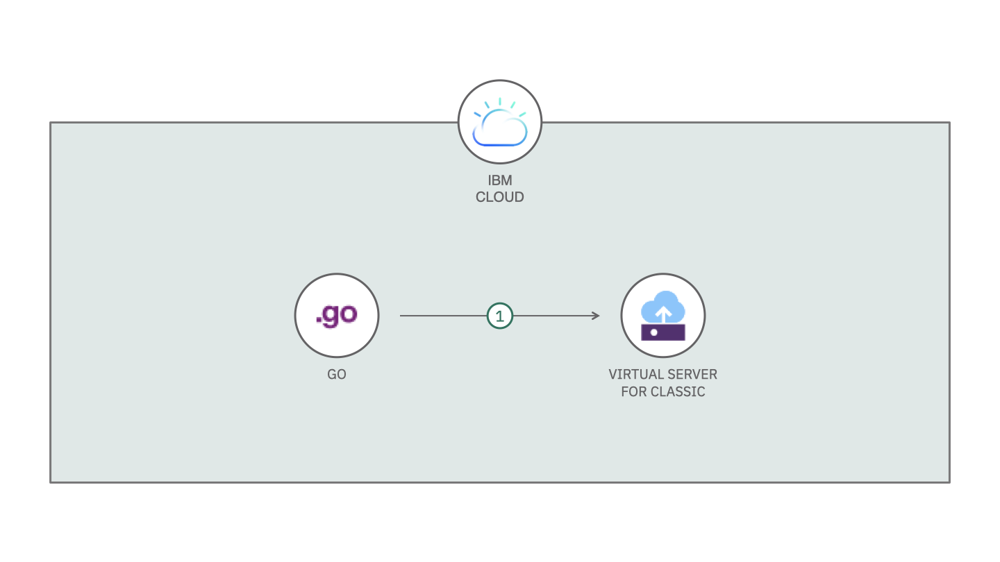
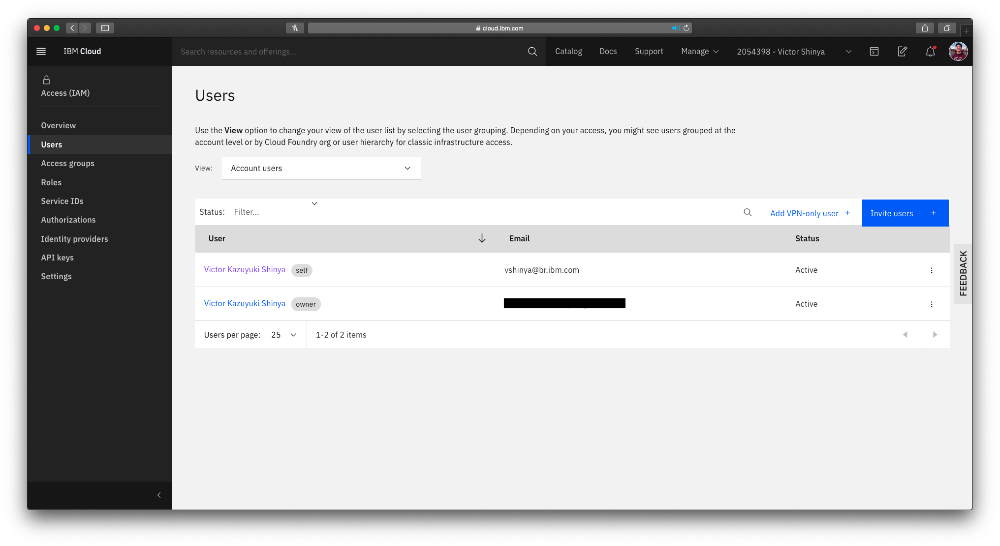
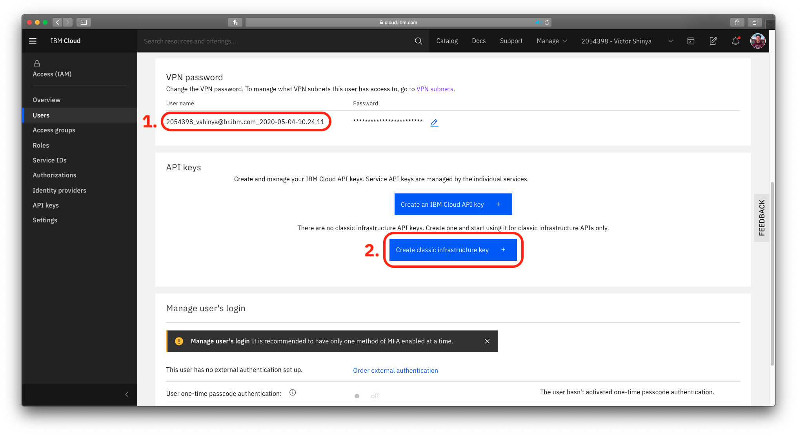

# IBM Cloud Instance Scheduler

[](https://cloud.ibm.com)
[](https://developer.ibm.com/?s=golang/)
[](https://goreportcard.com/report/github.com/victorshinya/instance-scheduler)
[](https://github.com/victorshinya/instance-scheduler/blob/master/LICENSE)
[](https://github.com/victorshinya/instance-scheduler/pulls)

A Serverless function to automatically start and stop IBM Cloud Virtual Server Instances.



## Deploy to IBM Cloud

Before you get started, you need to install [IBM Cloud CLI](https://cloud.ibm.com/docs/cli/reference/ibmcloud/download_cli.html#install_use) and [IBM Cloud Functions CLI](https://cloud.ibm.com/openwhisk/learn/cli) in your local machine. Then, you need to login in your IBM Cloud account on IBM Cloud CLI (if you haven't already done, run `ibmcloud login`).

### 1. Clone the repository

Download the source code from Github and access the project folder.

```sh
git clone https://github.com/victorshinya/instance-scheduler.git
cd instance-scheduler
```

### 2. Get Username and generate Classic Infrastructure API key

As you can manage your infrastructure using a SDK or API, you have to authenticate with a `username` and `apikey`. To get your username for the current account and generate the classic infrastructure API key. Go to [Manage > Access (IAM) > Users](https://cloud.ibm.com/iam/users) and click on your name on the list.



1. Scroll down to the `VPN password` section and copy the `Username`. This is going to be used on Instance Scheduler.
2. Scroll down to the `API keys` section and click on `Create classic infrastructure key` to automatically generate your API key. Copy the key. You are going to use it with `username`.



### 3. Update the parameters on manifest.yml

Open [manifest.yml](manifest.yml) and replace the following:

- [ Line 27 and 43 ] `<vpn-username>` by the username from previous step.
- [ Line 30 and 46 ] `<classic-infrastructure-api-key>` by the classic infrastructure api key from previous step.
- [ Line 36 and 49 ] `<virtual-server-name>` by the name of your IBM Cloud Virtual Server instance.

### 4. Set the time to power off and power on the VSI

On the same file from previous step, it is set (by default) to power off the VSI at 03:00 AM (00:00 AM GMT-3) and to power on the VSI at 09:00 AM (06:00 AM GMT-3). Update if you need to run both actions at the desire hour.

### 5. Deploy the Action, Triggers and Rules

Run the following command to deploy `main.go` function and to set up the Triggers and Rules.

> As you are using IBM Cloud Functions, you don't need to install any package or setup a package.json. The platform already has all libraries required to run the source code.

```sh
ibmcloud fn deploy --manifest manifest.yml
```

## LICENSE

Copyright 2020 Victor Shinya

Licensed under the Apache License, Version 2.0 (the "License");
you may not use this file except in compliance with the License.
You may obtain a copy of the License at

       http://www.apache.org/licenses/LICENSE-2.0

Unless required by applicable law or agreed to in writing, software
distributed under the License is distributed on an "AS IS" BASIS,
WITHOUT WARRANTIES OR CONDITIONS OF ANY KIND, either express or implied.
See the License for the specific language governing permissions and
limitations under the License.
